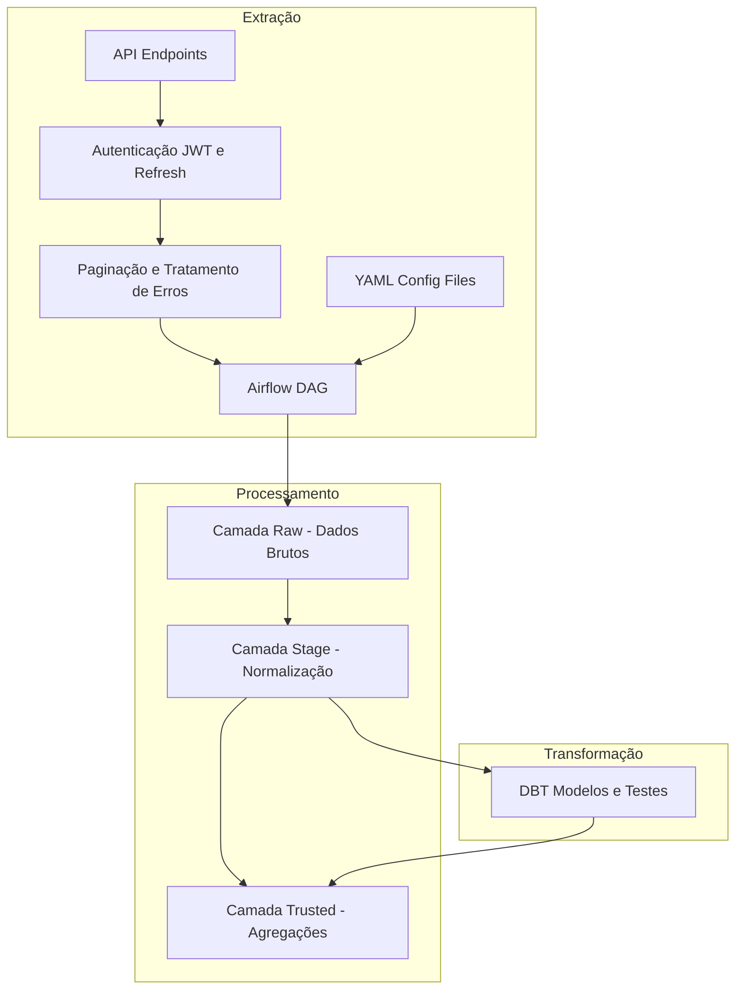

# Desafio de Engenharia de Dados com Airflow

Este projeto implementa uma solução completa de ETL usando Apache Airflow para processar dados de uma API de e-commerce. A solução inclui autenticação, tratamento de erros e processamento em três camadas (Raw, Stage e Trusted) usando DBT para transformações.

## Arquitetura da Solução



## Pré-requisitos
- Docker Desktop (inclui Docker Engine e Docker Compose v2)
- Git
- Mínimo de 8GB de RAM e 30GB de espaço em disco

## Portas e Bancos de Dados
### Portas
- 8080: Airflow Webserver
- 8000: API
- 5432: PostgreSQL

### Bancos de Dados
- airflow: Banco do Airflow
- api: Banco da API  
- ecommerce: Banco para dados processados

## Setup do Ambiente

Clone o repositório:
```bash
git clone https://github.com/JhusNeto/airflow-engineering-challenge.git
cd airflow-engineering-challenge
```

Construa e inicie os serviços:
```bash
docker compose up --build
```

Verifique os containers:
```bash
docker ps
```

## Endereços
- Documentação DBT (Stage e Trusted): http://localhost:8085/
- Airflow: http://localhost:8080/

## Estrutura do Projeto

```
api/           : Código da API simulada de e-commerce
config/        : Arquivos YAML de configuração
dags/          : DAGs do Airflow
  ├─ sql/      : Scripts SQL
  │   └─ create_stage_tables.sql  : Criação das tabelas Stage
  │
  ├─ stage/    : Processamento da camada Stage
  │   └─ stage_manager.py : Gerenciamento do processamento da camada Stage
  │
  ├─ storage/  : Gerenciamento de armazenamento
  │   └─ raw_manager.py   : Gerenciamento da camada Raw
  │
  ├─ api_manager.py      : Gerenciamento de requisições à API
  ├─ auth_dag.py         : Gerenciamento de autenticação (DAG)
  ├─ dbt_trusted_dag.py  : Transformações DBT (DAG)
  ├─ extract_dag.py      : Extração de dados da API (DAG)
  └─ stage_dag.py        : Processamento da camada Stage (DAG)

dbt/           : Modelos e transformações DBT
  ├─ models/   : Modelos SQL para transformação
  │   └─ trusted/ : Camada Trusted
  │       ├─ customer_rfm.sql           : Análise RFM de clientes
  │       ├─ logistics_performance.sql   : Métricas de logística
  │       └─ product_sales_trend_weekly.sql : Tendências semanais de vendas
  │
  └─ dbt_project.yml : Configuração do projeto DBT
init-scripts/  : Scripts de inicialização dos bancos
local_storage/ : Armazenamento da camada Raw
  ├─ carts/    : Dados brutos de carrinhos (formato: carts_YYYYMMDD_HHMMSS.json)
  ├─ customers/: Dados brutos de clientes (formato: customers_YYYYMMDD_HHMMSS.json)
  ├─ logistics/: Dados brutos de logística (formato: logistics_YYYYMMDD_HHMMSS.json)
  └─ products/ : Dados brutos de produtos (formato: products_YYYYMMDD_HHMMSS.json)
logs/         : Logs do Airflow
plugins/      : Plugins customizados do Airflow
.gitignore    : Arquivos e diretórios ignorados pelo Git
docker-compose.yml: Definição dos serviços e configurações do Docker Compose
README.md     : Documentação do projeto
```

## Fluxo de Dados

### Camada Raw
- Dados brutos em JSON.
- Organização: /local_storage/raw/{endpoint}/{YYYY-MM-DD}/

### Camada Stage
- Dados normalizados em PostgreSQL.
- Tabelas com estrutura dinâmica.
- Colunas de controle ETL.

### Camada Trusted
- Modelos DBT para análise.
- Agregações e métricas de negócio.

#### Exemplos:
- Análise RFM de clientes
- Desempenho logístico
- Análise de pagamentos

## DAGs do Airflow
- **auth_dag:** Gerencia autenticação JWT
  - Obtém tokens iniciais
  - Implementa refresh automático
  - Trata erros com retry exponencial
- **extract_dag:** Extrai dados da API
  - Configuração via YAML
  - Paginação automática
  - Tratamento de erros 500
- **stage_dag:** Processa dados para Stage
  - Flattening de JSON
  - Criação dinâmica de tabelas
  - Controle de tipos de dados
- **dbt_trusted_dag:** Executa transformações DBT
  - Modelos analíticos
  - Métricas de negócio
  - Documentação de linhagem

## Comandos Úteis
### Parar os containers
```bash
docker compose down
```

### Ver logs
```bash
docker logs <container_id>
```

### Executar DBT manualmente
```bash 
docker exec -it airflow-webserver bash
cd dbt && dbt run
```

### Ver documentação
```bash
http://localhost:8085/
```

## Observações Importantes
- A API simula erros 500 aleatórios (20% de chance).
- Tokens JWT expiram em 30 minutos.
- Paginação limitada a 50 registros por request.
- Dados são gerados automaticamente pela API.
- Todas as timestamps estão em UTC.

## Troubleshooting
- Erro de autenticação: Verifique os logs do auth_dag.
- Falha na extração: Confira os logs do container da API.
- Problemas no DBT: Verifique a conexão com o banco ecommerce.

## Documentação Adicional
- [teste_tecnico.md](docs/teste_tecnico.md): Requisitos detalhados.
- [api_doc.md](docs/api_doc.md): Documentação da API.
- [data_flow.md](docs/data_flow.md): Diagrama detalhado do fluxo.
