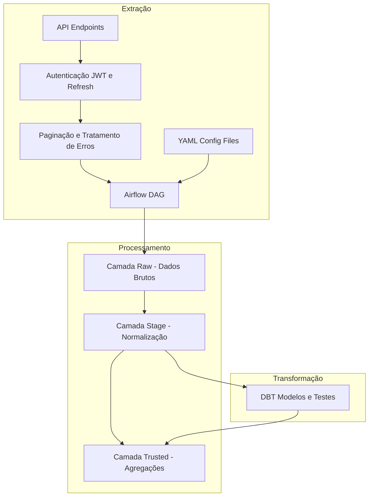

# Desafio de Engenharia de Dados com Airflow e DBT

Este projeto demonstra uma solução robusta de ETL para dados de e-commerce, integrando Apache Airflow para orquestração e DBT para transformações. A solução implementa autenticação JWT, tratamento avançado de erros e processamento em três camadas (Raw, Stage e Trusted).

> **Destaques:**
> - **Escalabilidade:** Processamento modular e orquestrado.
> - **Robustez:** Tratamento de erros e autenticação com retry exponencial.
> - **Transparência:** Linhagem de dados documentada via DBT.

---

## Sumário
- [Desafio de Engenharia de Dados com Airflow e DBT](#desafio-de-engenharia-de-dados-com-airflow-e-dbt)
  - [Sumário](#sumário)
  - [Arquitetura da Solução](#arquitetura-da-solução)
  - [Pré-requisitos](#pré-requisitos)
  - [Portas e Bancos de Dados](#portas-e-bancos-de-dados)
    - [Portas](#portas)
    - [Bancos de Dados](#bancos-de-dados)
  - [Setup do Ambiente](#setup-do-ambiente)
  - [Endereços e Acessos](#endereços-e-acessos)
  - [Estrutura do Projeto](#estrutura-do-projeto)
  - [Fluxo de Dados](#fluxo-de-dados)
    - [Camada Raw](#camada-raw)
    - [Camada Stage](#camada-stage)
    - [Camada Trusted](#camada-trusted)
    - [DAGs do Airflow](#dags-do-airflow)
  - [Comandos Úteis](#comandos-úteis)
    - [Parar os Containers](#parar-os-containers)
    - [Iniciar os Containers](#iniciar-os-containers)
    - [Verificar os Containers](#verificar-os-containers)
    - [Verificar os Logs](#verificar-os-logs)
    - [Executar Transformações DBT Manualmente](#executar-transformações-dbt-manualmente)
    - [Acessar a Documentação DBT](#acessar-a-documentação-dbt)
  - [Observações Importantes](#observações-importantes)
  - [Troubleshooting](#troubleshooting)
  - [Documentação Adicional](#documentação-adicional)
  - [Considerações Finais](#considerações-finais)

---

## Arquitetura da Solução



## Pré-requisitos
- Docker Desktop: Inclui Docker Engine e Docker Compose v2.
- Git: Para clonar o repositório.
- Hardware: Mínimo de 8GB de RAM e 30GB de espaço em disco.

## Portas e Bancos de Dados

### Portas
- 8080: Airflow Webserver
- 8000: API
- 5432: PostgreSQL

### Bancos de Dados
- airflow: Banco utilizado pelo Airflow.
- api: Banco da API.
- ecommerce: Banco para dados processados.

## Setup do Ambiente

1. Clone o repositório
```bash
git clone https://github.com/JhusNeto/airflow-engineering-challenge.git
cd airflow-engineering-challenge
```

2. Construa e inicie os serviços
```bash
docker compose up --build -d
```

3. Verifique os containers
```bash
docker ps
```

## Endereços e Acessos
- Airflow Webserver: http://localhost:8080/
- Documentação DBT (Stage e Trusted): http://localhost:8085/
- API: http://localhost:8000/

## Estrutura do Projeto
```
├── api/                     # Código da API simulada de e-commerce
├── config/                  # Arquivos YAML de configuração
├── dags/                    # DAGs do Airflow
│   ├── sql/                 # Scripts SQL
│   │   └── create_stage_tables.sql  # Criação das tabelas Stage
│   ├── stage/               # Processamento da camada Stage
│   │   └── stage_manager.py # Gerenciamento do processamento Stage
│   ├── storage/             # Gerenciamento de armazenamento (Raw)
│   │   └── raw_manager.py   # Gerenciamento da camada Raw
│   ├── api_manager.py       # Gerenciamento de requisições à API
│   ├── auth_dag.py          # Autenticação JWT (DAG)
│   ├── extract_dag.py       # Extração de dados da API (DAG)
│   ├── stage_dag.py         # Processamento da camada Stage (DAG)
│   └── dbt_trusted_dag.py   # Transformações DBT (DAG)
├── dbt/                     # Modelos e transformações DBT
│   ├── models/              # Modelos SQL para transformação
│   │   └── trusted/         # Modelos da camada Trusted
│   │       ├── customer_rfm.sql           # Análise RFM de clientes
│   │       ├── logistics_performance.sql   # Métricas de logística
│   │       └── product_sales_trend_weekly.sql# Tendências semanais de vendas
│   └── dbt_project.yml       # Configuração do projeto DBT
├── init-scripts/            # Scripts de inicialização dos bancos
├── local_storage/           # Armazenamento dos dados brutos (Raw)
│   ├── carts/               # Dados de carrinhos (carts_YYYYMMDD_HHMMSS.json)
│   ├── customers/           # Dados de clientes (customers_YYYYMMDD_HHMMSS.json)
│   ├── logistics/           # Dados de logística (logistics_YYYYMMDD_HHMMSS.json)
│   └── products/            # Dados de produtos (products_YYYYMMDD_HHMMSS.json)
├── logs/                    # Logs do Airflow
├── plugins/                 # Plugins customizados do Airflow
├── .gitignore               # Arquivos/diretórios ignorados pelo Git
├── docker-compose.yml       # Configuração dos serviços Docker
└── README.md                # Documentação do projeto
```

## Fluxo de Dados   

### Camada Raw
- Formato: Dados brutos em JSON.
- Organização: /local_storage/raw/{endpoint}/{YYYY-MM-DD}/

### Camada Stage
- Formato: Dados normalizados em PostgreSQL.
- Características: Tabelas com estrutura dinâmica e colunas de controle ETL.

### Camada Trusted
- Propósito: Modelos DBT para análise e agregação.
- Utilização: Geração de métricas de negócio e insights estratégicos.

**Exemplos de Análises:**
- Análise RFM de clientes
- Desempenho logístico
- Análise de pagamentos

### DAGs do Airflow 
- **auth_dag:** Gerencia a autenticação JWT.
  - Obtém tokens iniciais e realiza refresh automático.
  - Trata erros com retry exponencial.
- **extract_dag:** Realiza a extração dos dados da API.
  - Configuração flexível via YAML.
  - Implementa paginação automática e tratamento de erros (HTTP 500).
- **stage_dag:** Processa e normaliza os dados para a camada Stage.
  - Realiza flattening de JSON.
  - Cria tabelas dinamicamente e controla tipos de dados.
- **dbt_trusted_dag:** Executa as transformações com DBT.
  - Aplica modelos analíticos e gera métricas de negócio.
  - Documenta a linhagem dos dados para rastreabilidade.

## Comandos Úteis

### Parar os Containers
```bash
docker compose down
```

### Iniciar os Containers
```bash
docker compose up -d
```

### Verificar os Containers
```bash
docker ps
```

### Verificar os Logs
```bash
docker logs -f <container_name>
```

### Executar Transformações DBT Manualmente
```bash
docker exec -it airflow-webserver bash
cd dbt && dbt run
```

### Acessar a Documentação DBT
Abra http://localhost:8085/ no navegador.

## Observações Importantes
- API: Simula erros 500 aleatórios (20% de chance).
- Autenticação: Tokens JWT expiram em 30 minutos.
- Paginação: Limitada a 50 registros por request.
- Geração de Dados: Os dados são gerados automaticamente pela API.
- Time Zone: Todas as timestamps estão em UTC.

## Troubleshooting
- Erro de Autenticação: Verifique os logs do auth_dag.
- Falha na Extração: Confira os logs do container da API.
- Problemas no DBT: Certifique-se da conexão com o banco ecommerce.

## Documentação Adicional
- [Requisitos Detalhados](teste_tecnico.md)
- [Documentação da API](api_doc.md)
- [Diagrama Detalhado do Fluxo](data_flow.md)

## Considerações Finais
Este projeto foi desenvolvido como parte de um teste técnico para demonstrar habilidades em engenharia de dados, com foco em:

- Arquitetura de dados moderna e escalável
- Desenvolvimento de pipelines ETL robustos
- Orquestração de dados com Apache Airflow
- Transformações com dbt
- Containerização com Docker
- Tratamento de erros e resiliência
- Documentação clara e abrangente

O objetivo foi criar uma solução completa que pudesse lidar com dados de e-commerce de forma eficiente e confiável, seguindo boas práticas de engenharia de software e arquitetura de dados.

A implementação demonstra conhecimentos práticos em:
- Desenvolvimento de APIs
- Autenticação e segurança
- Processamento em camadas (Raw, Stage, Trusted)
- Modelagem dimensional
- Métricas de negócio
- Documentação técnica
- DevOps e containerização

O código está disponível para análise e pode ser usado como referência para projetos similares, respeitando as devidas atribuições.
